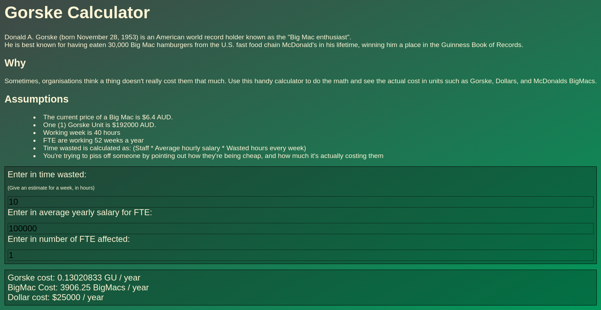

# Gorske Calculator

A simple calculator built to calculate the wasted cost against the Well Known(TM) Gorske unit, or the lesser known Big Mac Unit.




## Building

```bash
rustup target add wasm32-unknown-unknown
cargo install trunk wasm-bindgen-cli
```
## Running

```bash
trunk serve
```